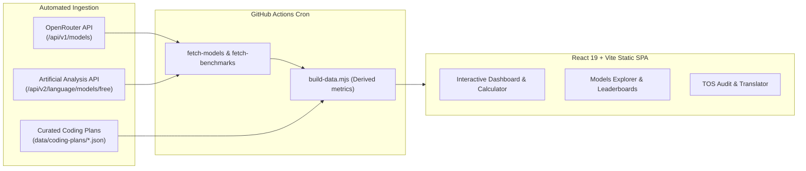

# ⚡ Token-Max: AI Model & Coding Plan Usage Tracker

[](https://heretek-ai.github.io/Token-Max/)
[](https://heretek-ai.github.io/Token-Max/#/models)
[](https://heretek-ai.github.io/Token-Max/#/plans)
[](LICENSE)

> **Unobfuscate vague terms like "credits" and "requests" into definitive token counts.**  
> An open-source dashboard tracking live pricing for **440+ foundation models** and **33+ developer coding subscriptions** to help you get the most intelligence out of every dollar.

---

## 🎯 Live Application

👉 **[Launch Token-Max](https://heretek-ai.github.io/Token-Max/)**

---

## ✨ Key Features

### 1. 💰 Budget Calculator ("What does $20 get me?")
- Set any monthly budget ($1 to $500).
- Instantly see which models maximize your token output (e.g. at $20/month, get **130M+ tokens** with DeepSeek V4.1 Flash vs. **2M–10M tokens** with flagship frontier models).
- Directly compare pay-per-token API yields against all subscription plans in that price tier.
- **Lab Decision Engine modes**: beyond the standard single-option comparison, two stacking modes reshape the recommendation:
  - **Mix & Match**: combines *distinct lesser subscriptions* whose summed price fits the budget via a greedy knapsack (2–4 subs) — e.g. a $10 plan + a $10 plan offered as a combined $20 package with the summed token yield.
  - **Dangerous Dave Mode**: stacks multiple copies of the *same* subscription to hit the budget — e.g. a $160 budget showing the 16×-stacked yield of each $10 plan (same model, multiplied allowance). Check each provider's TOS on account stacking.

### 2. 🔍 Models Catalog & Pricing Explorer
- Live data ingested daily from **OpenRouter**.
- Breakdown of input, cached input, reasoning, and output costs per 1M tokens.
- **Blended Cost** calculation (weighted 3:1 input:output) and **Cost per 1,000 requests** (2k in, 1k out).
- Context windows, parameter filters, and provider comparisons.

### 3. 🔄 Token Translator (Subscription Credits → Tokens)
- Select any IDE or agent plan (e.g., *GitHub Copilot Pro* $10/mo with $15 in AI Credits, or *Kiro Pro* $20/mo with 1,000 credits).
- Translates those opaque credit balances into estimated token counts across different LLMs (Sonnet 5, GPT-5.6, Gemini Flash, DeepSeek).

### 4. 📊 Quality vs. Cost & Benchmarks
- Direct integration with **Artificial Analysis** benchmark indices:
  - **Intelligence Index** (v4.x composite)
  - **Coding Index** (SWE-bench Verified, LiveCodeBench, Terminal-Bench)
  - **Agentic Index** (multi-step tool use)
- **Quality vs. Cost Scatter Plot**: Log-scale visualization pinpointing the Pareto frontier of models offering the best benchmark performance per dollar.

### 5. 🛡️ Terms-of-Service & Privacy Audit
- **Data Training Matrix**: Highlights whether your code is used to train AI models on Free, Individual, or Enterprise tiers.
- **Hidden Gotchas & Restrictions**: Documents 5-hour rolling limits, tool-only API keys (with ban risks), quota freezes, lack of IP indemnity, and peak/off-peak pricing traps.

### 6. 🧰 Developer Workflow Breakeven Calculator
- Models a real agent workload — daily vs. session mode, peak context, MCP tool stack, and output tokens per turn — instead of raw credit math.
- Measures modeled demand against each plan's token capacity using a selectable **estimate basis** (conservative 🔒, midpoint ⚖️, or optimistic 🔓) from the tier token budgets.
- Surfaces the true per-subscription breakeven point against pay-per-token API pricing.

---

## 🩸 Visual Identity

The UI is themed around the **Heretek Blood & Steel** design system — grimdark void surfaces, blood-red accents, and brass/rust rails — defined entirely in the `@theme` block of `src/index.css`. Brand assets (favicon, logotype included in Header/Footer via `public/icon-sm.png` / `public/logo-web.png`) ship in-tree.

---

## 🗂️ Tracked Services & Platforms (33+)

| Category | Platforms Included |
| :--- | :--- |
| **Coding IDEs & Agents** | Cursor • GitHub Copilot • Claude Code • OpenAI Codex • Google Antigravity/Jules • Meta Muse Code • Kiro (AWS) • Kilo AI • Lovable • Kimi Code • Windsurf (Devin) • Augment Code • Replit • Amazon Q Developer • Tabnine • Aider |
| **Routers & Coding Plans** | CommandCode • OpenCode • OpenRouter • BytePlus ModelArk • Alibaba Cloud AI Token Plan • MiniMax • Z.ai (GLM DevPack) |
| **Direct APIs (Pay-Per-Token)** | OpenAI API • Anthropic Claude API • Google AI Studio • DeepSeek API • Groq • Mistral API • Together.ai • Fireworks.ai • Meta Model API • Ollama Cloud |

---

## 📚 Documentation & Agent Standards

Comprehensive architectural documentation and agent instructions are provided in the repository:

| Document | Description |
| :--- | :--- |
| [**`AGENTS.md`**](AGENTS.md) | Universal guidelines for all AI coding agents working on this codebase (Claude Code, Gemini CLI, OpenCode, Codex, Aider, Windsurf). Details architecture invariants, schema enforcement, and prohibited antipatterns. |
| [**`CLAUDE.md`**](CLAUDE.md) | Dedicated developer guide tailored for **Claude Code** and Anthropic AI CLI tools, including fast build/lint commands and model classification logic. |
| [**`GEMINI.md`**](GEMINI.md) | Dedicated developer guide for **Google Antigravity** and Gemini CLI agents, including Codebase Knowledge Graph MCP tool conventions and verification rules. |
| [**`docs/DATA_SOURCES.md`**](docs/DATA_SOURCES.md) | Complete reference for all external data sources (OpenRouter API, Artificial Analysis API v2), data conversion formulas, and deep-dive documentation for all 33 coding plans. |
| [**`docs/MAINTAINABILITY.md`**](docs/MAINTAINABILITY.md) | Operations runbook, automated daily cron workflows, manual data refresh procedures, troubleshooting guide, and step-by-step instructions for adding new subscription plans. |

---

## 🛠️ Architecture & Data Pipeline



- **Daily Refresh**: GitHub Actions cron (`.github/workflows/update-data.yml`) updates pricing and benchmarks daily at 06:00 UTC.
- **Static Hosting**: Deployed directly on GitHub Pages with zero runtime backend dependency.

---

## 💻 Local Development

### Prerequisites
- Node.js 20+
- npm

### Installation
```bash
git clone https://github.com/Heretek-AI/Token-Max.git
cd Token-Max
npm install
```

### Data Pipeline Commands
```bash
# Fetch latest OpenRouter models
npm run fetch-models

# Fetch benchmarks from Artificial Analysis (requires AA_API_KEY)
AA_API_KEY="your_api_key" npm run fetch-benchmarks

# Build and consolidate final JSON datasets
npm run build-data

# Run all 3 in sequence
npm run update-data
```

### Run Web App
```bash
npm run dev
```

### Production Build & Lint
```bash
npm run lint
npm run build
```

---

## 📄 License

MIT © [Heretek-AI](https://github.com/Heretek-AI)
