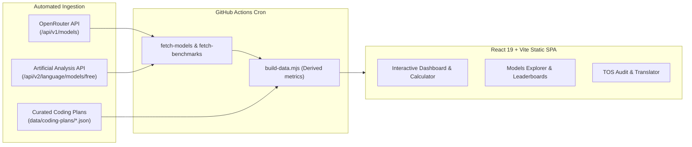

# ⚡ Token-Max: AI Model & Coding Plan Usage Tracker

[](https://heretek-ai.github.io/Token-Max/)
[](https://heretek-ai.github.io/Token-Max/#/models)
[](https://heretek-ai.github.io/Token-Max/#/plans)
[](LICENSE)

> **Unobfuscate vague terms like "credits" and "requests" into definitive token counts.**  
> An open-source dashboard tracking live pricing for **440+ foundation models** and **33+ developer coding subscriptions** to help you get the most intelligence out of every dollar.

---

## 🎯 Live Application

👉 **[Launch Token-Max](https://heretek-ai.github.io/Token-Max/)**

---

## ✨ Key Features & Analytical Tools

Token-Max provides an end-to-end workbench for engineering teams, independent developers, and AI researchers to audit, simulate, and optimize AI coding costs:

### 1. 💰 Budget Calculator ("What does $X get me?")
- Set any monthly budget ($1 to $500).
- Instantly see which models maximize your token output (e.g. at $20/month, get **130M+ tokens** with DeepSeek Flash vs. **2M–10M tokens** with flagship frontier models).
- Directly compare pay-per-token API yields against all subscription plans in that price tier.
- **Lab Decision Engine modes**:
  - **Mix & Match**: combines *distinct lesser subscriptions* whose summed price fits the budget via a greedy knapsack (2–4 subs).
  - **Dangerous Dave Mode**: stacks multiple copies of the *same* subscription to hit the budget. Checks provider stacking policies automatically.

### 2. 🖥️ Local Hardware vs Cloud Breakeven Calculator (`#/hardware`)
- Models upfront hardware CapEx (12, 24, 36, or 48 months depreciation with residual salvage resale value).
- Models real electricity OpEx (system TDP watts under active inference vs idle at regional `$/kWh` utility rates).
- Calculates the exact **Breakeven Inflection Point** and **Crossover Token Volume** against cloud APIs (Claude 3.7 Sonnet, DeepSeek-V3, GPT-4o) and subscriptions.
- 6 curated workstation presets: **Mac Mini M4 Pro (64GB)**, **Mac Studio M4 Max (128GB)**, **Mac Studio M4 Ultra (192GB)**, **Custom Dual RTX 5090 (64GB)**, **Single RTX 5090 (32GB)**, and **Homelab RTX 4090 (24GB)**.
- Local model feasibility matrix with VRAM headroom bars, generation throughput (t/s), max context lengths, and coding benchmark ratings.

### 3. 🧾 Autonomous Agent Session Receipt & Log Analyzer (`#/receipt`)
- 100% client-side parser reading transcripts in browser memory with zero network data transmission.
- Ingests **Google Antigravity / Gemini CLI JSONL** (`transcript.jsonl`), **Cline / Roo Code** (`ui_messages.json`), **Aider markdown logs**, and built-in sample session.
- Generates an itemized thermal receipt breaking down Fresh Inputs, Cached Context Reads (with discounts), and Visible Code Diffs.
- Cross-model repricing across 7+ models (DeepSeek Flash, DeepSeek-R1, Gemini Flash, o3-mini, Sonnet 5, Opus 5).
- Subscription quota impact gauges for Cursor fast requests and Claude Code rolling pools.

### 4. 🏢 Multi-Seat Team & Org Gateway Economics (`#/teams`)
- Models the 80/20 power-law distribution on engineering teams (70–80% casual developers consuming ~$3.80/mo vs 10–20% power developers consuming $78/mo).
- Compares flat $19–$40/seat licenses vs. centralized BYOK API gateway vs. the **Optimal Hybrid Strategy**.
- Demonstrates 35%–60% ($4,000 to $25,000/year) savings for a 25-engineer org.
- Generates an instant, copyable Markdown executive procurement memo.

### 5. 🧠 Extended Thinking & Reasoning Token Exploder (`#/reasoning`)
- Simulates hidden thinking token generation across configurable effort tiers (Off, Low 2K, Med 8K, High 24K, Max 48K).
- Quantifies the 4x–12x silent bill multiplier when using reasoning models in coding agents.
- **Plan Absorption Matrix**: Classifies 33 subscription plans by how they handle thinking tokens (Full Absorption, Quota Multiplier Penalty, or BYOK Pass-Through).

### 6. 🎛️ BYOK Agent Router Config Exporter (`#/exporter`)
- Generates copyable, downloadable, production-ready configuration files for:
  - **Aider** (`.aider.conf.yml`)
  - **Continue.dev** (`config.json`)
  - **Cline** (`cline_custom_modes.json`)
  - **OpenCode** (`opencode.json`)
  - **Cursor Rules** (`.cursorrules`)
- Real-time monthly cost preview based on selected primary coding and fast reasoning/architect models.

### 7. ⏱️ 5-Hour Burst & Window Throttle Simulator (`#/simulator`)
- Discrete 5-minute timestep simulation engine modeling sliding rate limits, rolling 5-hour pools, concurrency caps, and queue degradation cliffs.
- Simulates real agent bursts (Antigravity sprints, overnight PR loops, multi-agent refactors).
- Plan Headroom & Rate Limit Risk Matrix with color-coded safety margins.

### 8. 🔀 Multi-Model Mix & Overages Optimizer (`#/optimizer`)
- Composes complex multi-model development workflows (e.g. 70% Sonnet 3.7 + 20% DeepSeek-R1 + 10% Gemini Flash).
- Simulates pool drain against all 34 plans and identifies exact overage charges.

### 9. 🔍 Models Catalog & Pricing Explorer (`#/models`)
- Live data ingested daily from **OpenRouter** covering 440+ models.
- Breakdown of input, cached input, reasoning, and output costs per 1M tokens.
- Blended Cost (3:1 chat) and Agentic Blended Cost (20:1 + prompt cache).

### 10. 🔄 Token Translator (Subscription Credits → Tokens) (`#/plans`)
- Translates opaque credit units and request caps into estimated token allowances across frontier and workhorse models.

### 11. 📊 Quality vs. Cost & Benchmarks (`#/benchmarks`)
- Artificial Analysis benchmark indices: Intelligence Index, Coding Index (SWE-bench, LiveCodeBench), and Agentic Index.
- Pareto frontier quality vs cost scatter plot.

### 12. 🛡️ Terms-of-Service & Privacy Audit (`#/tos`)
- Data Training Matrix classifying training policies across Free, Individual, and Enterprise tiers.
- Documents 5-hour rolling limits, tool-only API keys, lack of IP indemnity, and stacking policies.

---

## 🩸 Visual Identity

The UI is themed around the **Heretek Blood & Steel** design system — grimdark void surfaces, blood-red accents, and brass/rust rails — defined entirely in the `@theme` block of `src/index.css`. Brand assets (favicon, logotype included in Header/Footer via `public/icon-sm.png` / `public/logo-web.png`) ship in-tree.

---

## 🗂️ Tracked Services & Platforms (33+)

| Category | Platforms Included |
| :--- | :--- |
| **Coding IDEs & Agents (14)** | Cursor • GitHub Copilot • Claude Code • OpenAI Codex • Google Antigravity • Meta Muse Code • Kiro (AWS) • Lovable • Windsurf • Augment Code • Replit • Amazon Q Developer • Tabnine • Aider |
| **Routers & Coding Plans (5)** | CommandCode • Kilo Code • OpenCode • OpenRouter • Kimi Code |
| **Direct APIs & Cloud Token Plans (14)** | Z.ai GLM Coding Plan • BytePlus ModelArk • Alibaba Cloud Token Plan • MiniMax • OpenAI API • Anthropic API • Google AI Studio • DeepSeek API • Groq • Mistral API • Together.ai • Fireworks.ai • Meta Model API • Ollama Cloud |

---

## 📚 Documentation & Agent Standards

Comprehensive architectural documentation and agent instructions are provided in the repository:

| Document | Description |
| :--- | :--- |
| [**`SOURCE.md`**](SOURCE.md) | Authoritative primary evidence index, official documentation links, stated quota limits, and token derivation evidence for all 33 coding plans and model providers. |
| [**`AGENTS.md`**](AGENTS.md) | Universal guidelines for all AI coding agents working on this codebase (Claude Code, Gemini CLI, OpenCode, Codex, Aider, Windsurf). Details architecture invariants, schema enforcement, and prohibited antipatterns. |
| [**`CLAUDE.md`**](CLAUDE.md) | Dedicated developer guide tailored for **Claude Code** and Anthropic AI CLI tools, including fast build/lint commands and model classification logic. |
| [**`GEMINI.md`**](GEMINI.md) | Dedicated developer guide for **Google Antigravity** and Gemini CLI agents, including Codebase Knowledge Graph MCP tool conventions and verification rules. |
| [**`docs/DATA_SOURCES.md`**](docs/DATA_SOURCES.md) | Complete reference for all external data sources (OpenRouter API, Artificial Analysis API v2), data conversion formulas, and deep-dive documentation for all 33 coding plans. |
| [**`docs/MAINTAINABILITY.md`**](docs/MAINTAINABILITY.md) | Operations runbook, automated daily cron workflows, manual data refresh procedures, troubleshooting guide, and step-by-step instructions for adding new subscription plans. |

---

## 🛠️ Architecture & Data Pipeline



- **Daily Refresh**: GitHub Actions cron (`.github/workflows/update-data.yml`) updates pricing and benchmarks daily at 06:00 UTC.
- **Static Hosting**: Deployed directly on GitHub Pages with zero runtime backend dependency.

### 🌐 Published Machine-Readable Datasets

As part of the continuous deployment workflow to GitHub Pages, Token-Max automatically compiles and publishes static, structured JSON files for external tools, CLI scripts, and researchers:

- **Usage Limits Dataset**: [`https://heretek-ai.github.io/Token-Max/data/usage-limits.json`](https://heretek-ai.github.io/Token-Max/data/usage-limits.json)
  - 422 normalized token and request limit usages broken down per provider, tier, and supported model across all 34 services.
  - Includes empirical agent task capacity (small 250K, medium 550K, complex 900K turns), basis formulas, vendor disclosure flags (`disclosedByVendor`, `isEstimatedCeiling`), and source links to primary docs and OSINT dossiers.
- **Curated Plans Dataset**: [`https://heretek-ai.github.io/Token-Max/data/plans.json`](https://heretek-ai.github.io/Token-Max/data/plans.json)
- **Foundation Models Catalog**: [`https://heretek-ai.github.io/Token-Max/data/models.json`](https://heretek-ai.github.io/Token-Max/data/models.json)
- **Data Freshness Timestamp**: [`https://heretek-ai.github.io/Token-Max/data/last-updated.json`](https://heretek-ai.github.io/Token-Max/data/last-updated.json)

---

## 💻 Local Development

### Prerequisites
- Node.js 20+
- npm

### Installation
```bash
git clone https://github.com/Heretek-AI/Token-Max.git
cd Token-Max
npm install
```

### Data Pipeline Commands
```bash
# Fetch latest OpenRouter models
npm run fetch-models

# Fetch benchmarks from Artificial Analysis (requires AA_API_KEY)
AA_API_KEY="your_api_key" npm run fetch-benchmarks

# Build and consolidate final JSON datasets
npm run build-data

# Run all 3 in sequence
npm run update-data
```

### Run Web App
```bash
npm run dev
```

### Quality & Verification Checks
```bash
# Validate 34 plan files against schema invariants
npm run validate-data

# Run full unit test suite (109 tests across 8 suites)
npm test

# Run linter (oxlint: 0 errors, 0 warnings enforced)
npm run lint

# Production build (tsc -b && vite build)
npm run build
```

---

## 📄 License

MIT © [Heretek-AI](https://github.com/Heretek-AI)
