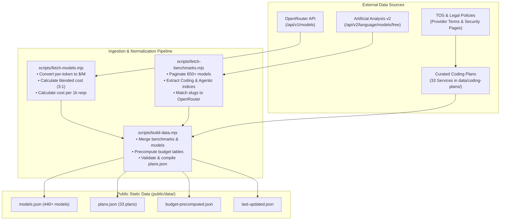

# 📚 Sources of Data & Methodology — Token-Max

> **Last Updated:** September 2026  
> **Repository:** [https://github.com/Heretek-AI/Token-Max](https://github.com/Heretek-AI/Token-Max)  
> **Live Site:** [https://heretek-ai.github.io/Token-Max/](https://heretek-ai.github.io/Token-Max/)

---

## 1. Data Philosophy & Overview

AI developer tooling in 2026 has fragmented into a bewildering array of billing abstractions: "AI credits", "effort units", "checkpoints", "agent tasks", "5-hour rolling pools", and "fast vs. slow requests". 

**Token-Max** exists to normalize these disparate business models into transparent, comparable metrics:
1. **Raw Token Economics**: How many input, output, and cached tokens does a dollar buy?
2. **Effective Subscription Value**: How many real tokens can a developer extract from a $10, $20, $50, or $200 monthly subscription before hitting throttles or overages?
3. **Quality-Per-Dollar (Value Score)**: How do model prices correlate with verified real-world benchmark performance (SWE-bench, LiveCodeBench, Terminal-Bench)?

To achieve this, Token-Max synthesizes data from four primary sources:
- **Live OpenRouter API**: Comprehensive catalog of 440+ foundation model endpoints, pricing, and context windows.
- **Artificial Analysis API (v2)**: Independent quality benchmarks (Coding Index, Agentic Index, Intelligence Index) and inference performance metrics.
- **Curated Coding Subscription Database**: 33 manually verified JSON documents specifying tier pricing, credit formulas, rate limits, and model allowances.
- **Terms-of-Service & Privacy Audits**: Manual legal review of each provider's data training and IP indemnity policies.

---

## 2. Source 1: OpenRouter Models API

- **Endpoint:** `GET https://openrouter.ai/api/v1/models`
- **Authentication:** Public (optional bearer token via `OPENROUTER_API_KEY` to increase rate limits).
- **Ingestion Script:** [`scripts/fetch-models.mjs`](file:///home/john/Projects/Token-Max/scripts/fetch-models.mjs)

### Data Extraction & Transformations
1. **Modality Filtering**: We only ingest models where `architecture.output_modality` includes `text` (filtering out pure image/audio generation models).
2. **Pricing Normalization**:
   - OpenRouter returns rates in fractional dollars per single token (e.g. `"0.000002"`).
   - We convert all rates into **USD per 1 Million tokens**:
     $$\text{inputPrice} = \text{parseFloat}(\text{pricing.prompt}) \times 1,000,000$$
     $$\text{outputPrice} = \text{parseFloat}(\text{pricing.completion}) \times 1,000,000$$
   - Cached read discounts (`pricing.request_discount` or cached token pricing) and reasoning token rates are captured where published.
3. **Blended Cost Formulas**:
   - **Legacy Chatbot Blended Cost (3:1)**:
     $$\text{Blended Cost (\$/M)} = \frac{3 \times \text{Input Cost} + 1 \times \text{Output Cost}}{4}$$
   - **Token-Max Agentic Blended Cost (20:1 with Prompt Caching)**:
     Modern coding agents (Cursor, Claude Code, Cline, Copilot Edits) ingest substantial repository context (AST, file snippets, linter logs) for concise code diffs.
     We standardize on the **Token-Max Agent Request**: **20,000 input context tokens + 1,000 output completion tokens (21,000 total)** with a dynamic prompt cache hit rate ($H$):
     $$\text{Cost per Request} = \frac{20,000 \times (1 - H) \times P_{\text{in}} + 20,000 \times H \times P_{\text{cached}} + 1,000 \times P_{\text{out}}}{1,000,000}$$
     $$\text{Agent Blended Cost (\$/M)} = \frac{\text{Cost per Request}}{21,000} \times 1,000,000$$
     Where $H = 0.75$ by default (typical agent session), and $P_{\text{cached}}$ reflects provider-specific cache discount multipliers ($90\%$ off for Anthropic, DeepSeek, and Z.ai; $75\%$ off for Gemini; $50\%$ off for OpenAI).

4. **Variant Separation**:
   Models with `:free` or `:batch` suffixes are flagged (`isFree: true`, `isBatch: true`) to avoid skewing standard pay-as-you-go comparisons.

---

## 3. Source 2: Artificial Analysis Language Models API (v2)

- **Endpoint:** `GET https://artificialanalysis.ai/api/v2/language/models/free`
- **Authentication:** `x-api-key: AA_API_KEY` (secret managed in GitHub repository secrets).
- **Documentation:** [https://artificialanalysis.ai/data-api/docs#overview-hero](https://artificialanalysis.ai/data-api/docs#overview-hero)
- **Ingestion Script:** [`scripts/fetch-benchmarks.mjs`](file:///home/john/Projects/Token-Max/scripts/fetch-benchmarks.mjs)

### Pagination & Metric Extraction
The script paginates through all available models (page size ~200, tracking `has_more` across 650+ models) and extracts:

| Metric | Field in AA API | Meaning for Developers |
| :--- | :--- | :--- |
| **Coding Index** | `evaluations.artificial_analysis_coding_index` | Composite coding evaluation based on **SWE-bench Verified**, **LiveCodeBench**, and **Terminal-Bench**. The primary benchmark for code intelligence. |
| **Agentic Index** | `evaluations.artificial_analysis_agentic_index` | Measures multi-step autonomous decision making, tool-calling accuracy, and long-horizon task completion. |
| **Intelligence Index** | `evaluations.artificial_analysis_intelligence_index` | General reasoning and problem-solving capability (GPQA, MMLU-Pro, reasoning tasks). |
| **Throughput (Tokens/s)** | `performance.median_output_tokens_per_second` | Speed of code generation. Crucial for fast autocomplete and interactive pair programming. |
| **Latency (TTFT)** | `performance.median_time_to_first_token_seconds` | Time To First Token. Determines editor responsiveness when triggering completions. |

### Quality Scoring & Intelligence Weights
To provide a developer-centric evaluation, Token-Max weights benchmark components with heavy emphasis on software engineering utility:
$$\text{Weighted Score} = 0.50 \times \text{Coding Index} + 0.30 \times \text{Agentic Index} + 0.20 \times \text{Intelligence Index}$$

### Quality-Per-Dollar ("Value Score") Formula
$$\text{Value Score} = \frac{\text{Coding Index}}{\text{Blended Cost (\$/M)}} \times 10$$
Models with high coding intelligence and low per-token cost score highest on the Value Score (e.g. DeepSeek V4.1 Flash, Gemini 3.8 Flash, GLM-5.3-Flash, Qwen 3.8 Max).

---

## 4. Source 3: Curated Coding Subscription Database (33 Services)

All subscription plans are tracked as structured, schema-validated JSON files in [`data/coding-plans/`](file:///home/john/Projects/Token-Max/data/coding-plans/).

### Schema Standard (`_schema.json`)
Every file must strictly validate against `data/coding-plans/_schema.json`:
- `id`: Slug matching filename without extension.
- `name`: Official service name.
- `category`: `"coding-ide"` | `"coding-router"` | `"api-provider"`.
- `url`: Official subscription or pricing URL.
- `lastVerified`: Date of last verification (`YYYY-MM-DD`).
- `tiers`: Array of tier objects with `limits`, `models`, `estimatedTokenBudget`, and `monthlyPrice`.
- `gotchas`: Array of caveats, gotchas, and hidden fees.
- `dataTraining`: Data privacy and retention policy.
- `ipIndemnity`: Indemnification status.

### Complete Directory of Tracked Services

#### A. Coding IDEs & Agentic Environments (16 Services)
1. **Cursor** (`cursor.json`): [https://cursor.com/pricing](https://cursor.com/pricing)
   - *Tiers:* Hobby ($0), Pro ($20), Pro+ ($60), Ultra ($200).
   - *Unit Math:* Pro provides a ~$20 third-party API compute pool + 500 fast requests (~10M tokens), with on-demand fallback billing.
2. **GitHub Copilot** (`github-copilot.json`): [https://github.com/features/copilot/plans](https://github.com/features/copilot/plans)
   - *Tiers:* Free ($0), Pro ($10), Pro+ ($39), Max ($100).
   - *Unit Math:* 1 AI Credit = $0.01 USD. Pro includes 1,500 credits ($15 value, ~7.5M Sonnet 5 tokens). Pro+ includes 7,000 credits ($70 value). Max includes 20,000 credits ($200 value).
3. **Claude Code** (`claude-code.json`): [https://anthropic.com](https://anthropic.com)
   - *Tiers:* Pro ($20), Max5x ($100), Max20x ($200).
   - *Unit Math:* Shared 5-hour rolling limit (~45 msgs on Pro) shared with the Claude.ai web app. ~12M / ~60M / ~240M tokens/mo.
4. **OpenAI Codex** (`openai-codex.json`): [https://openai.com](https://openai.com)
   - *Tiers:* Free ($0), Go ($8), Plus ($20), Pro5x ($100), Pro20x ($200).
   - *Unit Math:* Plus provides 5–45 messages / 5h rolling (~12M tokens/mo) with shared quota between ChatGPT Canvas and Codex CLI.
5. **Google Antigravity / Jules** (`google-antigravity.json`): [https://google.com/ai](https://google.com/ai)
   - *Tiers:* Individual ($0), AI Pro ($19.99), Ultra5x ($99.99), Ultra20x ($199.99).
   - *Unit Math:* Jules tasks (15 / 75 / 300 / 1,200 daily background agent tasks) + 5-hour Gemini refresh cycles.
6. **Meta Muse Code** (`meta-muse-code.json`): [https://developer.meta.com/ai/lp/muse-code/](https://developer.meta.com/ai/lp/muse-code/)
   - *Tiers:* Everyday ($5), High ($15), Power ($50).
   - *Unit Math:* 10–50 req/5h (Everyday) up to unlimited priority reqs (Power) with Muse Spark 1.3 and Llama 4 Code.
7. **Kiro (AWS)** (`kiro.json`): [https://kiro.dev/pricing/](https://kiro.dev/pricing/)
   - *Tiers:* Free ($0), Pro ($20), Pro+ ($40), ProMax ($100), Power ($200).
   - *Unit Math:* 1,000 / 2,000 / 5,000 / 10,000 monthly credits. Add-on credits cost $0.04/credit. Multipliers: Sonnet 1.3x, Opus 2.2x, Haiku 0.4x, Fable 6.0x, Sol 4.4x. Credits do not roll over.
8. **Lovable** (`lovable.json`): [https://lovable.dev/pricing](https://lovable.dev/pricing)
   - *Tiers:* Free ($0), Pro ($25), Business ($50).
   - *Unit Math:* Build credits (5 daily free, 100/mo Pro, 250/mo Business). Top-ups: Pro $0.30/credit, Business $0.60/credit.
9. **Kimi Code (Moonshot)** (`kimi-code.json`): [https://www.kimi.com/code/docs/en/](https://www.kimi.com/code/docs/en/)
   - *Tiers:* Plus (¥79/~$19), Pro (¥159/~$39), Max (¥559/~$199).
   - *Unit Math:* HighSpeed quota tiers with 1M–2M context window on K3 2.8T model.
10. **Windsurf (Codeium)** (`windsurf.json`): [https://windsurf.dev](https://windsurf.dev)
    - *Tiers:* Free ($0), Pro ($20), Max ($200), Teams ($40/seat).
    - *Unit Math:* Unlimited autocomplete + 500 fast Cascade prompts/mo (~15M tokens on Pro).
11. **Augment Code** (`augment-code.json`): [https://augmentcode.com](https://augmentcode.com)
    - *Tiers:* Business ($100), Enterprise (Custom).
    - *Unit Math:* Effort/credit metered by codebase task complexity with $15 auto-top-up blocks.
12. **Replit** (`replit.json`): [https://replit.com/pricing](https://replit.com/pricing)
    - *Tiers:* Core ($20), Pro ($100).
    - *Unit Math:* 50 Agent checkpoints/mo (Core) vs 300 checkpoints/mo (Pro) + dedicated cloud VM specs.
13. **Amazon Q Developer** (`amazon-q.json`): [https://aws.amazon.com/q/developer/pricing/](https://aws.amazon.com/q/developer/pricing/)
    - *Tiers:* Free ($0), Pro ($19/seat).
    - *Unit Math:* 1,000 chat requests/mo, 4,000 completion lines/mo, 30 dev agent tasks/mo. Overages at $0.003/line.
14. **Tabnine** (`tabnine.json`): [https://tabnine.com/pricing](https://tabnine.com/pricing)
    - *Tiers:* Starter ($0), Pro ($15), Enterprise ($39).
    - *Unit Math:* Unlimited whole-line completions + 500 chats/day (~10M tokens/mo) with Zero Data Retention.
15. **Aider** (`aider.json`): [https://aider.chat](https://aider.chat)
    - *Tiers:* Free / BYOK ($0).
    - *Unit Math:* 100% free open-source software; users pay raw API provider rates with 0% markup.

#### B. Routers & Coding Token Packages (8 Services)
16. **Z.ai GLM Coding Plan** (`z-ai.json`): [https://z.ai/subscribe](https://z.ai/subscribe)
    - *Tiers:* Lite ($18), Pro ($72), Max ($160), Team Standard ($80/seat).
    - *Unit Math:* Dual limit system (2K/10K credits on Lite, 12K/60K on Pro, 28K/140K on Max). Off-peak hours enjoy a 50% credit rate discount. Drop-in Claude Code and OpenAI endpoints.
17. **Kilo AI** (`kilo-code.json`): [https://kilo.ai/pricing/kilo-pass](https://kilo.ai/pricing/kilo-pass)
    - *Tiers:* Starter ($19), Pro ($49), Expert ($199), Teams ($15/seat).
    - *Unit Math:* Kilo Pass provides 40–50% bonus credit pools spent at 0% API markup.
18. **CommandCode** (`commandcode.json`): [https://commandcode.dev](https://commandcode.dev)
    - *Tiers:* Go ($1), GOAT ($10), Pro ($20), Max10x ($100), Max20x ($200).
    - *Unit Math:* $10 / $70 / $80 / $150 / $300 in compute credits with 5-hour rolling limits ($3–$75) and weekly caps ($6–$200).
19. **OpenCode** (`opencode.json`): [https://opencode.ai](https://opencode.ai)
    - *Tiers:* Go ($10), Zen (PAYG).
    - *Unit Math:* Monthly spend cap ($10 on Go) with max 20% in any 5-hour window and 50% weekly cap.
20. **OpenRouter** (`openrouter.json`): [https://openrouter.ai](https://openrouter.ai)
    - *Tiers:* Free ($0), PAYG.
    - *Unit Math:* Wholesale API pass-through with a 5.5% top-up fee.
21. **BytePlus ModelArk** (`byteplus.json`): [https://www.byteplus.com/en/activity/codingplan](https://www.byteplus.com/en/activity/codingplan)
    - *Tiers:* Lite ($10), Pro ($50).
    - *Unit Math:* 24,000 requests/mo (Lite) and 120,000 requests/mo (Pro) strictly restricted to developer tooling.
22. **Alibaba Cloud** (`alibaba-cloud.json`): [https://www.alibabacloud.com/en/campaign/ai-landing-page-token](https://www.alibabacloud.com/en/campaign/ai-landing-page-token)
    - *Tiers:* Personal Lite ($6), Standard ($18), Pro ($68), Team Standard ($20/seat), Team Pro ($75/seat), Team Max ($200/seat).
    - *Unit Math:* Dedicated monthly token quotas (~10M to ~450M tokens/seat) on the Qwen series.
23. **MiniMax** (`minimax.json`): [https://minimax.ai](https://minimax.ai)
    - *Tiers:* Plus ($22), Max ($55), Ultra ($132).
    - *Unit Math:* Prepaid credits (1,000 credits = $1 USD) valid for 365 days, with 3–7 concurrent agent threads.

#### C. Direct Pay-As-You-Go Model APIs (10 Services)
24. **OpenAI API** (`openai-api.json`): [https://platform.openai.com](https://platform.openai.com)
    - GPT-6 Astra ($10 in / $50 out), Sol ($2 in / $10 out), Terra ($2 in / $12 out), Luna ($0.20 in / $1.20 out).
25. **Anthropic API** (`anthropic-api.json`): [https://console.anthropic.com](https://console.anthropic.com)
    - Claude Fable 5.1 ($10/$50), Claude Opus 5 ($5/$25), Claude Sonnet 5 ($2/$10), Claude Haiku 4.5 ($1/$5). 90% discount on cache reads.
26. **Google AI Studio** (`google-ai-studio.json`): [https://aistudio.google.com](https://aistudio.google.com)
    - Free tier (15 RPM, 1M TPM) + tiered spend caps ($250, $2,000, $100,000) for Gemini 3.8 Flash ($0.75/$3.75) and Pro.
27. **DeepSeek API** (`deepseek-api.json`): [https://platform.deepseek.com](https://platform.deepseek.com)
    - Time-of-day pricing: Flash off-peak ($0.15/$0.60) vs peak ($0.30/$1.20). 98% discount on cache hits.
28. **Groq API** (`groq-api.json`): [https://console.groq.com](https://console.groq.com)
    - LPU ultra-fast hardware inference (400–800 tokens/sec) on open weights.
29. **Mistral API** (`mistral-api.json`): [https://console.mistral.ai](https://console.mistral.ai)
    - Codestral 2501, Mistral Large 2. 50% batch discount, 90% prefix cache discount.
30. **Together.ai** (`together-ai.json`): [https://together.ai](https://together.ai)
    - Serverless and dedicated hosting for 100+ open-source models with spend tier progressions ($25/$50/$100/$250).
31. **Fireworks.ai** (`fireworks-ai.json`): [https://fireworks.ai](https://fireworks.ai)
    - 6,000 RPM serverless inference with sub-100ms time-to-first-token.
32. **Meta Model API** (`meta-model-api.json`): [https://meta.com](https://meta.com)
    - Standard ($1.25/$4.25/M, 3,000 RPM) vs. Contributor ($0.10/$0.20/M, 60 RPM with model training rights).
33. **Ollama Cloud** (`ollama-cloud.json`): [https://ollama.com](https://ollama.com)
    - Free ($0), Pro ($20 for $60 credits), Max ($100 for $300 credits), Team ($500 for $1,600 credits).

---

## 5. Source 4: Terms of Service & Privacy Matrices

Data policies and legal clauses are tracked per provider in the plan JSON files and rendered in [`src/pages/TosAudit.tsx`](file:///home/john/Projects/Token-Max/src/pages/TosAudit.tsx):

| Service | Free Tier Data Training | Individual Paid Training | Team/Enterprise Training | IP Indemnity Protection |
| :--- | :---: | :---: | :---: | :---: |
| **GitHub Copilot** | ⚠️ Trains unless opted out | ⚠️ Trains unless opted out | ✅ Zero training | Enterprise only |
| **Claude Code (Anthropic)** | N/A | ✅ Opt-out by default | ✅ Zero training | Commercial terms only |
| **Cursor** | ⚠️ Opted-in by default | ✅ Privacy Mode (Zero retention) | ✅ Privacy Mode | ❌ Not provided |
| **OpenAI API** | N/A | ✅ Zero Data Retention | ✅ Zero Data Retention | ✅ Standard outputs |
| **Z.ai GLM Coding Plan** | N/A | ⚠️ Standard Cloud Terms | ✅ Zero training by default | Enterprise Team contracts |
| **Lovable** | ❌ Perpetual training license | ❌ Perpetual training license | ✅ Enterprise only | ❌ Not provided |
| **Replit** | ❌ Public repls trained on | ⚠️ Private repls shielded | ✅ Shielded | ❌ Not provided |
| **Tabnine** | ⚠️ Limited local | ✅ ZDR on Protected models | ✅ Air-gapped / VPC | ✅ Yes |
| **Augment Code** | N/A | ✅ Zero code retention | ✅ Zero code retention | ✅ Full legal indemnity |
| **Meta Muse (Contributor)**| ❌ Trains (90% discount) | ❌ Trains (90% discount) | N/A | ❌ Not provided |
| **Meta Muse (Standard)**   | ✅ Zero training | ✅ Zero training | ✅ Zero training | ❌ Not provided |
