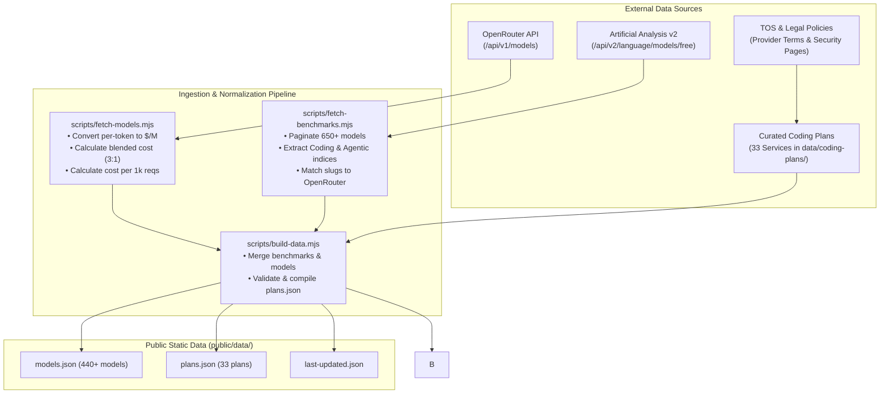

# 📚 Sources of Data & Methodology — Token-Max

> **Last Updated:** September 2026  
> **Repository:** [https://github.com/Heretek-AI/Token-Max](https://github.com/Heretek-AI/Token-Max)  
> **Live Site:** [https://heretek-ai.github.io/Token-Max/](https://heretek-ai.github.io/Token-Max/)

---

## 1. Data Philosophy & Overview

AI developer tooling in 2026 has fragmented into a bewildering array of billing abstractions: "AI credits", "effort units", "checkpoints", "agent tasks", "5-hour rolling pools", and "fast vs. slow requests". 

**Token-Max** exists to normalize these disparate business models into transparent, comparable metrics:
1. **Raw Token Economics**: How many input, output, and cached tokens does a dollar buy?
2. **Effective Subscription Value**: How many real tokens can a developer extract from a $10, $20, $50, or $200 monthly subscription before hitting throttles or overages?
3. **Quality-Per-Dollar (Value Score)**: How do model prices correlate with verified real-world benchmark performance (SWE-bench, LiveCodeBench, Terminal-Bench)?

To achieve this, Token-Max synthesizes data from four primary sources:
- **Live OpenRouter API**: Comprehensive catalog of 440+ foundation model endpoints, pricing, and context windows.
- **Artificial Analysis API (v2)**: Independent quality benchmarks (Coding Index, Agentic Index, Intelligence Index) and inference performance metrics.
- **Curated Coding Subscription Database**: 33 manually verified JSON documents specifying tier pricing, credit formulas, rate limits, and model allowances.
- **Terms-of-Service & Privacy Audits**: Manual legal review of each provider's data training and IP indemnity policies.

---

## 2. Source 1: OpenRouter Models API

- **Endpoint:** `GET https://openrouter.ai/api/v1/models`
- **Authentication:** Public (optional bearer token via `OPENROUTER_API_KEY` to increase rate limits).
- **Ingestion Script:** [`scripts/fetch-models.mjs`](file:///home/john/Projects/Token-Max/scripts/fetch-models.mjs)

### Data Extraction & Transformations
1. **Modality Filtering**: We only ingest models where `architecture.output_modality` includes `text` (filtering out pure image/audio generation models).
2. **Pricing Normalization**:
   - OpenRouter returns rates in fractional dollars per single token (e.g. `"0.000002"`).
   - We convert all rates into **USD per 1 Million tokens**:
     $$\text{inputPrice} = \text{parseFloat}(\text{pricing.prompt}) \times 1,000,000$$
     $$\text{outputPrice} = \text{parseFloat}(\text{pricing.completion}) \times 1,000,000$$
   - Cached read discounts (`pricing.request_discount` or cached token pricing) and reasoning token rates are captured where published.
3. **Blended Cost Formulas**:
   - **Legacy Chatbot Blended Cost (3:1)**:
     $$\text{Blended Cost (USD/M)} = \frac{3 \times \text{Input Cost} + 1 \times \text{Output Cost}}{4}$$
   - **Token-Max Agentic Blended Cost (20:1 with Prompt Caching)**:
     Modern coding agents (Cursor, Claude Code, Cline, Copilot Edits) ingest substantial repository context (AST, file snippets, linter logs) for concise code diffs.
     We standardize on the **Token-Max Agent Request**: **20,000 input context tokens + 1,000 output completion tokens (21,000 total)** with a dynamic prompt cache hit rate ($H$):
     $$\text{Cost per Request} = \frac{20,000 \times (1 - H) \times P_{\text{in}} + 20,000 \times H \times P_{\text{cached}} + 1,000 \times P_{\text{out}}}{1,000,000}$$
     $$\text{Agent Blended Cost (USD/M)} = \frac{\text{Cost per Request}}{21,000} \times 1,000,000$$
     Where $H = 0.75$ by default (typical agent session), and $P_{\text{cached}}$ reflects provider-specific cache discount multipliers (90% off for Anthropic, DeepSeek, and Z.ai; 75% off for Gemini; 50% off for OpenAI).
     The agentic blend is the default for Budget token yields; the legacy 3:1 blend is
     reserved for chat-style comparisons. Measured real-world baselines (78K tokens/request,
     84% cache, 25:1–166:1 input:output) and the full OSINT audit live in
     [`docs/TOKEN_ESTIMATE_VALIDATION.md`](file:///home/john/Projects/Token-Max/docs/TOKEN_ESTIMATE_VALIDATION.md).
   - **Single source of truth**: every executable use of these assumptions (request sizes,
     blend weights, default cache rate) reads
     [`data/estimate-constants.json`](file:///home/john/Projects/Token-Max/data/estimate-constants.json)
     via `src/lib/estimate-constants.ts` or directly in `scripts/*.mjs`. `calculateAgentRequestCost`
     accepts an optional `cacheWriteShare` to price prompt-cache writes at the published
     write rate (Anthropic 1.25× input; fallback `cacheWritePremium` in the JSON).

4. **Variant Separation**:
   Models with `:free` or `:batch` suffixes are flagged (`isFree: true`, `isBatch: true`) to avoid skewing standard pay-as-you-go comparisons.

---

## 3. Source 2: Artificial Analysis Language Models API (v2)

- **Endpoint:** `GET https://artificialanalysis.ai/api/v2/language/models/free`
- **Authentication:** `x-api-key: AA_API_KEY` (secret managed in GitHub repository secrets).
- **Documentation:** [https://artificialanalysis.ai/data-api/docs#overview-hero](https://artificialanalysis.ai/data-api/docs#overview-hero)
- **Ingestion Script:** [`scripts/fetch-benchmarks.mjs`](file:///home/john/Projects/Token-Max/scripts/fetch-benchmarks.mjs)

### Pagination & Metric Extraction
The script paginates through all available models (page size ~200, tracking `has_more` across 650+ models) and extracts:

| Metric | Field in AA API | Meaning for Developers |
| :--- | :--- | :--- |
| **Coding Index** | `evaluations.artificial_analysis_coding_index` | Composite coding evaluation based on **SWE-bench Verified**, **LiveCodeBench**, and **Terminal-Bench**. The primary benchmark for code intelligence. |
| **Agentic Index** | `evaluations.artificial_analysis_agentic_index` | Measures multi-step autonomous decision making, tool-calling accuracy, and long-horizon task completion. |
| **Intelligence Index** | `evaluations.artificial_analysis_intelligence_index` | General reasoning and problem-solving capability (GPQA, MMLU-Pro, reasoning tasks). |
| **Throughput (Tokens/s)** | `performance.median_output_tokens_per_second` | Speed of code generation. Crucial for fast autocomplete and interactive pair programming. |
| **Latency (TTFT)** | `performance.median_time_to_first_token_seconds` | Time To First Token. Determines editor responsiveness when triggering completions. |

### Quality Scoring & Intelligence Weights
To provide a developer-centric evaluation, Token-Max uses **one** weighted quality score everywhere (Models, Benchmarks, Budget and the planning tabs):
$$\text{Weighted Score} = \frac{0.50 \times \text{Coding} + 0.30 \times \text{Agentic} + 0.20 \times \text{Intelligence}}{\text{present weights}} \times \text{coverage penalty}$$
A coding index is required (models without one score 0 and are excluded from value rankings). Missing dimensions are penalized (×0.9 for one missing, ×0.75 for two) rather than renormalized away, so partially-measured models cannot leapfrog fully-measured ones.

### Quality-Per-Dollar ("Value Score") Formula
$$\text{Value Score} = \frac{\text{Weighted Score}}{\text{Blended Cost (USD/M)}} \times 100$$
The same score is persisted by `scripts/build-data.mjs`, recomputed in `src/lib/pricing.ts` (`computeValueScore`) and used by every page. Coding-quality thresholds come from a single `QUALITY` constant (`economy 40`, `value 50`, `workhorse 65`, `frontier 75`).

---

## 4. Source 3: Curated Coding Subscription Database (33 Services)

All subscription plans are tracked as structured, schema-validated JSON files in [`data/coding-plans/`](file:///home/john/Projects/Token-Max/data/coding-plans/).

### Verification Standard (Sept 2026 audit)
Every tier's `estimatedTokenBudget.assumptions` must contain an explicit estimation formula (unit count × tokens per unit at a blended cache-adjusted rate) and, where the vendor publishes no numbers, label the figure a low-confidence research estimate — never present an unpublished unit count as official. Tier `models` must reference models that resolve in `public/data/models.json` (or clearly-labeled proprietary/PAYG pool descriptors like "Kilo Gateway (500+ models)"). `url` must point at a page that currently loads (e.g. `windsurf.com/pricing`, `commandcode.ai/pricing`, `kilo.ai/pricing`, `claude.com/pricing`, `developer.meta.com/ai/products/muse-code`). The 2026-09-18 pass re-verified all 33 sources; plans whose quotas are intentionally opaque (Antigravity, Windsurf/Devin, Kimi Code, MiniMax, Amazon Q Pro) carry research-derived token estimates with explicit low-confidence assumptions.

### Schema Standard (`_schema.json`)
Every file must strictly validate against `data/coding-plans/_schema.json`:
- `id`: Slug matching filename without extension.
- `name`: Official service name.
- `category`: `"coding-ide"` | `"coding-router"` | `"api-provider"`.
- `url`: Official subscription or pricing URL.
- `lastVerified`: Date of last verification (`YYYY-MM-DD`).
- `tiers`: Array of tier objects with:
  - `limits`: non-empty human-readable quota/limit map (never `{}`).
  - `models`: non-empty supported-model list (never `[]`).
  - `estimatedTokenBudget`: `{ description, estimatedMillionTokens, midpointEstimate?, optimisticEstimate?, assumptions, estimateMeta }`. `estimatedMillionTokens` is a conservative floor and must be > 0 on every paid tier (the stacking modes drop zero budgets).
  - `estimateMeta`: `{ sourceUrl, sourceQuote?, sourceType: official|derived|research|community, confidence: high|medium|low, verifiedAt, basisModel?, cacheAssumption? }`.
- `gotchas`: Array of caveats, gotchas, and hidden fees.
- `dataTraining`: Data privacy and retention policy (classified per audience by `src/lib/tos.ts`).
- `ipIndemnity`: Indemnification status (boolean or descriptive string).
- `stackingPolicy`: `allowed` | `silent` | `prohibited` | `unknown` — whether buying multiple accounts of the service is permitted; `prohibited` requires a `stackingPolicyNote` with the evidence quote and gates the Dangerous Dave mode.
- `stackingPolicyNote`: Evidence quote/explanation for the stacking policy.

`npm run validate-data` enforces all of the above in CI (`scripts/validate-data.mjs`).

### Complete Directory of Tracked Services

All figures below were re-verified against official pages during the September 2026 audit; see [`SOURCE.md`](../SOURCE.md) for the exhaustive per-provider source directory, evidence quotes, and stated usage limits, and [`docs/VERIFICATION.md`](VERIFICATION.md) for the chronological audit log.

#### A. Coding IDEs & Agentic Environments (14 Services)
1. **Cursor** (`cursor.json`): [cursor.com/pricing](https://cursor.com/pricing) — Hobby ($0), Pro ($20), Pro Plus ($60), Ultra ($200). Pro+ and Ultra are officially **3x and 20x** Pro agent limits; pool sizes are unpublished and modelled at ~10M tokens (Pro) → 30M / 200M.
2. **GitHub Copilot** (`github-copilot.json`): [github.com/features/copilot/plans](https://github.com/features/copilot/plans) — Free ($0), Pro ($10), Pro+ ($39), Max ($100), Business ($19), Enterprise ($39). 1 AI credit = $0.01; Pro = $10 base + $5 variable Flex (1,500 credits), Pro+ = $39+$31, Max = $100+$100. Conservative estimates count base credits only; completions are unlimited on paid plans.
3. **Claude Code** (`claude-code.json`): [claude.com/pricing](https://claude.com/pricing) — Pro ($20), Max 5x ($100), Max 20x ($200). 5-hour rolling + weekly caps on a pool shared with Claude.ai; Anthropic publishes no token figures — estimates ~12M/60M/240M are research-derived with low confidence.
4. **OpenAI Codex** (`openai-codex.json`): [developers.openai.com/codex/pricing](https://developers.openai.com/codex/pricing) — Free ($0), Go ($8), Plus ($20), Pro 5x ($100), Pro 20x ($200). Codex usage is bundled inside ChatGPT plans; no numeric token quotas published.
5. **Google Antigravity** (`google-antigravity.json`): [antigravity.google/pricing](https://antigravity.google/pricing) — Individual ($0), Google AI Pro ($19.99), Google AI Ultra 5x ($99.99), Google AI Ultra 20x ($199.99). Overage via AI credits at GEAP pricing; third-party tooling against Antigravity OAuth is banned.
6. **Meta Muse Code** (`meta-muse-code.json`): [developer.meta.com/ai/products/muse-code](https://developer.meta.com/ai/products/muse-code) — Everyday ($5, 10–50 prompts/5h), High ($15, 5x Everyday), Power ($50, 20x Everyday). Subscription keys work only with Muse Code.
7. **Kiro (AWS)** (`kiro.json`): [kiro.dev/pricing](https://kiro.dev/pricing) — Free ($0), Pro ($20), Pro+ ($40), Pro Max ($100), Power ($200) with 50/1,000/2,000/5,000/10,000 monthly credits; add-on credits $0.04; no rollover. Third-party automation harnesses are not permitted.
8. **Lovable** (`lovable.json`): [lovable.dev/pricing](https://lovable.dev/pricing) — Free ($0), Pro 100 ($25), Business ($50); annual $21/$42. Build credits expire after 2 months; workspaces allow unlimited members (priced by credits, not seats).
9. **Kimi Code** (`kimi-code.json`): [kimi.ai/help/membership/membership-pricing](https://www.kimi.ai/help/membership/membership-pricing) — Moderato ($19), Allegretto ($39), Allegro ($99), Vivace ($199); annual $15/$31/$79/$159. Shared credit pool plus a separate Kimi Code 5-hour/weekly limit; credit counts unpublished.
10. **Windsurf (Cognition)** (`windsurf.json`): [windsurf.com/pricing](https://windsurf.com/pricing) — Free ($0), Pro ($20), Max ($200), Teams ($80 + $40/user). Credential sharing is banned by the AUP.
11. **Augment Code** (`augment-code.json`): [augmentcode.com/pricing](https://www.augmentcode.com/pricing) — Standard ($20, $20 usage pool), Business ($100, $100 pool), Enterprise (custom); up to 50 seats; LLM usage billed at provider list price + a flat 40% fee; top-ups valid 12 months.
12. **Replit** (`replit.json`): [replit.com/pricing](https://replit.com/pricing) — Core ($20, $18 annual), Pro ($100, $90 annual), Enterprise (custom). Core includes $20 of frontier model usage; Pro includes $100 credits and 10 parallel agents.
13. **Amazon Q Developer** (`amazon-q.json`): [aws.amazon.com/q/developer/pricing](https://aws.amazon.com/q/developer/pricing/) — Free ($0, 50 agentic requests/mo, 1,000 LOC transformation), Pro ($19/user/mo, 4,000 LOC pooled, $0.003/LOC overage, IP indemnity). AWS publishes no numeric Pro request cap.
14. **Tabnine** (`tabnine.json`): [tabnine.com/pricing](https://www.tabnine.com/pricing/) — Code Assistant ($39/user/mo), Agentic Platform ($59/user/mo), Enterprise (custom), all annual subscriptions. BYO LLM endpoint = unlimited; Tabnine-provided LLM access = provider list price + 5% handling fee.

#### B. Routers & Coding Token Packages (5 Services)
15. **Z.ai GLM Coding Plan** (`z-ai.json`): [z.ai/subscribe](https://z.ai/subscribe) — Lite ($18), Pro ($72), Max ($160), Team Standard ($80/seat). Official 95%-cache allowance table: GLM-5.3 48–97M / 290–580M / 676–1,352M tokens per week (Lite/Pro/Max); off-peak (outside Mon–Fri 14:00–18:00 UTC+8) bills at 50% credits. Conservative/midpoint/optimistic tier figures are derived from those published floors/ceilings.
16. **Kilo Code** (`kilo-code.json`): [kilo.ai/pricing](https://kilo.ai/pricing) — Individual ($0), Teams ($15/user/mo), Enterprise (custom). The $15 is a platform fee; inference passes through at provider rates with no markup (5% on credit top-ups). Kilo Pass: Starter $19 / Pro $49 / Expert $199 with up to 50% bonus credits.
17. **CommandCode** (`commandcode.json`): [commandcode.ai/pricing](https://commandcode.ai/pricing) — Go ($1, $10 credits), GOAT ($10, $70), Pro ($20, $80), Max 10x ($100, $150), Max 20x ($200, $300). Token estimates convert credit dollars at the plan's documented open-model blend; terms allow one account per person.
18. **OpenCode** (`opencode.json`): [opencode.ai/zen](https://opencode.ai/zen) — CLI (free/BYOK), Zen ($20 minimum prepaid balance + $1.23 card fee, zero markup), Go ($10/mo open-model subscription). Terms prohibit multiple accounts to circumvent limits.
19. **OpenRouter** (`openrouter.json`): [openrouter.ai/pricing](https://openrouter.ai/pricing) — Free ($0) and PAYG with a 5.5% platform fee; free-model limits are 20 RPM / 50 RPD (<10 credits) or 1,000 RPD. Multiple accounts to bypass limits are prohibited.

#### C. Direct API & Cloud Token Plans (14 Services)
20. **Alibaba Cloud Model Studio** (`alibaba-cloud.json`): [Token Plan docs](https://www.alibabacloud.com/help/en/model-studio/token-plan-overview) — Personal Lite ($6, 2,500 credits/7d), Essential ($10, 5,625), Standard ($18, 10,000), Pro ($68, 40,000); Team Standard ($20/seat, 25,000 credits/mo), Team Pro ($75, 100,000), Team Max ($200, 250,000); Extra Bundle $15 = 20,000 credits. Alibaba does not publish credit→token coefficients; estimates derive from the official qwen3.6-plus worked example (~200 credits/M input, 20/M cached, 1,204/M output) and are marked medium confidence.
21. **MiniMax Token Plan** (`minimax.json`): [platform.minimax.io](https://platform.minimax.io/docs/guides/pricing-token-plan) — Plus ($22), Max ($55), Ultra ($132); credits packages 1,000 credits = $1 (5,000/$5, 25,000/$25, 100,000/$100, valid 365 days). Token quotas are not published; figures are research estimates.
22. **BytePlus ModelArk Coding Plan** (`byteplus.json`): [byteplus.com/activity/arkcodingplan](https://www.byteplus.com/en/activity/arkcodingplan) — Lite ($10), Pro ($50). Marketing: Lite = 3x Claude Pro, Pro = 5x Lite; official docs list ≈1,900 req/5h, 12,000/week, 24,000/month (Lite). BytePlus AI terms state Customer Data is not used to train foundation models.
23. **OpenAI API** (`openai-api.json`): [platform.openai.com/docs/pricing](https://platform.openai.com/docs/pricing) — PAYG; Sol $2/$10, Luna $0.10/$0.60, spend caps $100/$500/$1,000/$5,000/$200,000. API data is not used for training by default; default retention is 30 days with ZDR available on request for eligible endpoints.
24. **Anthropic API** (`anthropic-api.json`): [docs.claude.com](https://docs.claude.com/en/docs/about-claude/pricing) — PAYG; Sonnet 5 $2/$10, cache reads at 0.1x, cache writes +25%, batch −50%; spend tiers Start $500 / Build $1,000 / Scale $200,000. Commercial terms prohibit training on Customer Content.
25. **Google AI Studio** (`google-ai-studio.json`): [ai.google.dev/pricing](https://ai.google.dev/gemini-api/docs/pricing) — Free tier; Tier1/2/3 spend caps ($250/$2,000/$20,000+). Gemini 3.8 Flash input $0.75 / output $3.75 (promotional through 2026-12-31). Free tier content is used to improve products; paid content is not.
26. **DeepSeek API** (`deepseek-api.json`): [api-docs.deepseek.com](https://api-docs.deepseek.com/quick_start/pricing) — PAYG in CNY: V4-Pro ¥9/M cache-miss input, ¥27/M output, cache-hit ¥0.15–0.30/M; off-peak is half price (peak = Beijing Mon–Fri 09–12 & 14–18).
27. **Groq API** (`groq-api.json`): [console.groq.com](https://console.groq.com) — Free and PAYG; the console publishes Developer-plan base limits (per-model RPM 10–30, RPD 100–1,000, TPM 1.2K–70K); Free-tier limits are lower and per-model.
28. **Mistral API** (`mistral-api.json`): [mistral.ai/pricing](https://mistral.ai/pricing) — Studio plan includes $10/mo API credits; PAYG with 50% batch and up to 90% prefix-cache discounts. Model training is **opt-out**, not off by default.
29. **Together.ai** (`together-ai.json`): [together.ai](https://together.ai) — Free and PAYG; Together uses dynamic rate limits (no fixed public RPM/TPM) that scale with account history.
30. **Fireworks.ai** (`fireworks-ai.json`): [fireworks.ai](https://fireworks.ai) — $1 free credits; account-wide 6,000 RPM ceiling once a card is on file; batch −50%.
31. **Meta Model API** (`meta-model-api.json`): [dev.meta.ai/docs/pricing-rate-limits](https://dev.meta.ai/docs/pricing-rate-limits) — now serves Muse Spark models (hosted Llama tiers superseded). Standard $1.25/$4.25 with no training; Contributor $0.10–$0.20 in exchange for training rights.
32. **Ollama Cloud** (`ollama-cloud.json`): [ollama.com/pricing](https://ollama.com/pricing) — Free ($0, 1 stream), Pro ($20, $60 credits, 3 streams), Max ($100, $300 credits, 10 streams), Team ($500, **$1,000 credits**, 10 streams). One account per person; peak pricing 12:00–18:00 UTC Mon–Fri.
33. **Aider** (`aider.json`): [aider.chat](https://aider.chat) — free open-source BYOK agent; no vendor pricing to track.

---

## 5. Source 4: Terms of Service & Privacy Matrices

Data policies and legal clauses are tracked per provider in the plan JSON files and classified by [`src/lib/tos.ts`](file:///home/john/Projects/Token-Max/src/lib/tos.ts) (shared by the TOS page, plan detail and compare views). "Unknown" means the provider publishes no explicit statement — it is not a safe verdict.

| Service | Free Tier | Individual Paid | Team/Enterprise | IP Indemnity |
| :--- | :---: | :---: | :---: | :---: |
| **GitHub Copilot** | ❌ Trains (opt-out) | ⚠️ Opt-out setting | ✅ No training | ❌ None |
| **Claude Code (Anthropic)** | — | ⚠️ Opt-out | ⚠️ Opt-out | ❌ None |
| **Cursor** | ⚠️ Privacy Mode opt-out | ⚠️ Privacy Mode opt-out | ⚠️ Privacy Mode opt-out | ❌ None |
| **OpenAI API** | — | ✅ No training (30-day retention, ZDR on request) | ✅ No training | ✅ Full |
| **Anthropic API** | — | ✅ No training (commercial terms) | ✅ No training | ✅ Full |
| **Z.ai GLM Coding Plan** | — | ❓ Unknown (standard terms) | ✅ Team no training | ❌ None |
| **Lovable** | ⚠️ Opt-out | ⚠️ Opt-out | ✅ No training | ❌ None |
| **Replit** | ❓ Unknown | ❓ Unknown | ❓ Unknown | ❌ None |
| **Tabnine** | — | ✅ No training | ✅ No training | ✅ Full |
| **Augment Code** | — | ✅ No training | ✅ No training | ❌ None |
| **Meta Model API** | — | Contributor ❌ trains / Standard ✅ no training | — | ❌ None |
| **Meta Muse Code** | — | ⚠️ Depends on selected models | — | ❌ None |
| **Google AI Studio** | ❌ Trains | ✅ No training (paid) | ✅ No training | ❌ None |
| **Google Antigravity** | ⚠️ Opt-out | ⚠️ Opt-out | ⚠️ Opt-out | ❌ None |
| **OpenAI Codex** | — | ⚠️ Opt-out | ✅ No training | ❌ None |
| **Amazon Q Developer** | ⚠️ Opt-out | ✅ No training | ✅ No training | ✅ Full (Pro) |
| **BytePlus** | — | ✅ No training (AI terms) | ✅ No training | ❌ None |
| **Alibaba Cloud Token Plan** | — | ❓ Unknown (personal) | ✅ Team no training | ❌ None |
| **MiniMax** | — | ❓ Unknown | ❓ Unknown | ❌ None |
| **Mistral API** | — | ⚠️ Opt-out | ⚠️ Opt-out | ❌ None |
| **Groq API** | — | ✅ No training | ✅ No training | ❌ None |
| **Together.ai** | — | ✅ No training | ✅ No training | ❌ None |
| **Fireworks.ai** | — | ✅ No training | ✅ No training | ❌ None |
| **DeepSeek API** | — | ✅ No training | ✅ No training | ❌ None |
| **Ollama Cloud** | — | ✅ No training | ✅ No training | ❌ None |
| **OpenCode** | — | ✅ ZDR | ✅ ZDR | ❌ None |
| **OpenRouter** | ✅ No training (provider-dependent) | ✅ No training (provider-dependent) | ❓ Unknown | ❌ None |
| **CommandCode** | ✅ No training | ✅ No training | ✅ No training | ❌ None |
| **Kimi Code** | — | ❓ Unknown | ❓ Unknown | ❌ None |
| **Kilo Code** | — | ✅ No training | ✅ No training | ❌ None |
| **Kiro** | — | ❓ Unknown | ❓ Unknown | ❌ None |
| **Windsurf** | — | ❓ Unknown | ❓ Unknown | ❌ None |
| **Aider** | — | ❓ Unknown (depends on API provider) | — | ❌ None |

The TOS page (`#/tos`) renders this matrix live from the JSON data, including per-plan `tosHighlights`, the `lastVerified` date and the multi-account `stackingPolicy` with its evidence.
