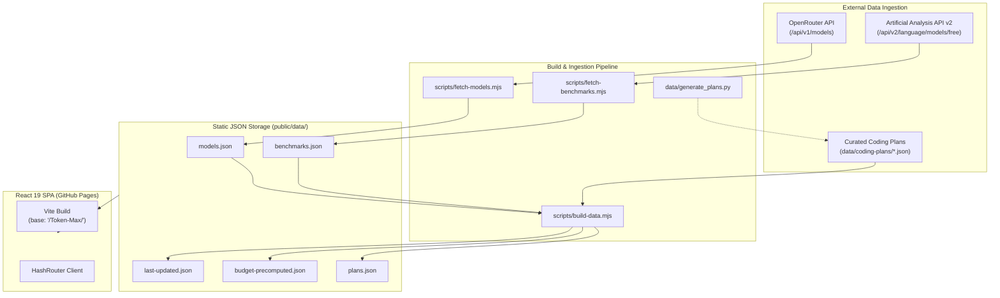

# 🛠️ Token-Max Maintainability & Operations Guide

> **Target Audience:** Core maintainers, automated workflows, and AI assistants responsible for maintaining, extending, and operating the Token-Max platform.

---

## 1. System Overview & Architecture Principles

Token-Max is built as a **zero-maintenance, static-first analytics platform**. It has no operational database, no server-side backend, and no container fleet.



### Core Architecture Principles:
1. **Pre-computation at Build Time**: All token conversion calculations, blended costs, request estimates, and benchmark cross-indexing are executed at build time. The user's browser performs zero heavy math or external network queries during runtime.
2. **Immutable Schema Compliance**: All curated coding plans conform strictly to `data/coding-plans/_schema.json`.
3. **Decoupled Data and Code**: New plans or model price updates require updating JSON files, not React component code (except for optional provider color themes).
4. **Resilient Degradation**: If an external API is unavailable (e.g. Artificial Analysis API key rate limit), the build pipeline falls back to existing cached datasets without crashing the frontend.

### Decision Engine Stacking Modes (Mix & Match + Dangerous Dave)

The Frontier Intelligence Decision Engine (`src/components/budget/LabDecisionEngine.tsx`) supports three mutually exclusive modes delivered by header pills: `standard` (default), `mix`, and `dave`. All stacking math lives in `src/lib/pricing.ts` so plans and UI stay decoupled:

1. **Candidate extraction** — `buildStackCandidates(models, plans, lab)` derives exactly **one best candidate per plan** (the tier with the best tokens-per-dollar, preferring tiers whose model strings match benchmarked models). Tiers whose `$estimatedTokenBudget.estimatedMillionTokens` is 0/absent, or whose model list only contains obsolete/legacy models (`gpt-3.5`, `claude-2`, etc.), are excluded. This relies on schema requirement **B/`estimatedTokenBudget`-never-null** — do not loosen it.
2. **Mix & Match** — `computeMixAndMatch(candidates, budget, maxSubs=3)`: greedy knapsack over candidates sorted by tokens-per-dollar; items that would overflow the budget are *skipped, not dropped* (so a $15 plan can be bypassed by two $8 plans). Duplicate greedy passes are deduped; max 3 bundles returned. Cap is 2–4 subs, default 3 — keep the cap to avoid combinatorial blow-up at high budgets.
3. **Dangerous Dave** — `computeDaveStacks(candidates, budget)`: for each unique plan+tier, `qty = floor(budget / tierPrice)`; stacks with `qty >= 2` are ranked by total tokens (e.g. budget $160 vs a $10 plan → 16× stack). Returns top 8.
4. **Raw vs. normalized values**: stacking uses the *raw* tier `estimatedMillionTokens` and `monthlyPrice`. This is deliberately different from the standard mode's leaderboard, which *normalizes* tier yields to the site budget (`tokensPerDollar × budget`). Do not feed normalized values back into the stack math — it would double-count the budget.
5. **UI surface**: when a stacking mode is active, a dedicated panel renders below the three standout cards, and labeled `Mixed Bundle` / `Stacked ×N` rows are appended to the ranked leaderboard. The standard verdict callout and cards remain visible in all modes as the single-option baseline. Extreme stack quantities (e.g. 160× a $1 plan) are intentional in Dave mode; the TOS caveat about account stacking is displayed in the panel header.


---

## 2. Automated Daily Pipeline (`.github/workflows/update-data.yml`)

Token-Max runs an automated GitHub Actions cron workflow daily at **06:00 UTC** to refresh model pricing and benchmark scores.

### Workflow Configuration
Located at `.github/workflows/update-data.yml`:
- **Trigger:** Daily cron schedule (`0 6 * * *`) and `workflow_dispatch` (manual trigger).
- **Secrets Required:**
  - `AA_API_KEY`: Artificial Analysis API key (for fetching benchmark metrics and quality indices).
  - `OPENROUTER_API_KEY`: Optional; increases rate limits when fetching from OpenRouter.
  - `GITHUB_TOKEN`: Standard repository token with `contents: write` permissions to commit data updates.

### Execution Sequence
1. Checks out repository `main` branch.
2. Sets up Node.js 20.x environment with caching.
3. Installs dependencies (`npm ci`).
4. Runs `npm run update-data`:
   ```bash
   node scripts/fetch-models.mjs
   node scripts/fetch-benchmarks.mjs
   node scripts/build-data.mjs
   ```
5. Runs `git diff --quiet public/data/` to verify if data changed:
   - If changes detected: Commits with `chore(data): automated daily pricing & benchmark update [skip ci]`.
   - Pushes directly to `main`, which automatically triggers `.github/workflows/deploy.yml` to publish to GitHub Pages.

---

## 3. Manual Data Refresh Runbook

When urgent price cuts occur (e.g., Anthropic or OpenAI announce an unexpected 50% API price drop) or when testing local enhancements, perform a manual data update:

### Step 1: Set Environment Variables
```bash
export AA_API_KEY="your_artificial_analysis_api_key"
export OPENROUTER_API_KEY="optional_openrouter_api_key"
```

### Step 2: Run Fetch & Build
```bash
# 1. Fetch OpenRouter models (~440+ models)
npm run fetch-models

# 2. Fetch Artificial Analysis benchmarks
npm run fetch-benchmarks

# 3. Consolidate and compute derived budget/score metrics
npm run build-data
```

### Step 3: Verify Output
Check that generated files exist and contain valid JSON:
```bash
node -e "
const models = JSON.parse(fs.readFileSync('public/data/models.json'));
const plans = JSON.parse(fs.readFileSync('public/data/plans.json'));
console.log('Models count:', models.length);
console.log('Plans count:', plans.length);
"
```

### Step 4: Validate Lint & Build
```bash
npm run lint
npm run build
```

---

## 4. How to Add a New Coding Subscription Plan (34th+ Plan)

Follow this step-by-step checklist whenever a new developer AI subscription, coding agent, or API plan enters the market.

### Checklist:
- [ ] 1. Obtain Official Pricing & Documentation
- [ ] 2. Create Plan JSON File in `data/coding-plans/<id>.json`
- [ ] 3. Update `data/generate_plans.py` for Reproducibility
- [ ] 4. Register Provider Brand Color in `src/lib/pricing.ts`
- [ ] 5. Run Validation & Build Pipeline
- [ ] 6. Test in UI & Commit

---

### Detailed Walkthrough

#### Step 1: Create `data/coding-plans/<id>.json`
The file name must match the `id` property. The schema requires:

```json
{
  "$schema": "./_schema.json",
  "id": "example-code",
  "name": "Example Code AI",
  "category": "coding-ide",
  "url": "https://example.com/pricing",
  "lastVerified": "2026-09-19",
  "tiers": [
    {
      "name": "Free",
      "monthlyPrice": 0,
      "annualPrice": 0,
      "limits": {
        "monthlyTokens": 500000,
        "rateLimit": "20 RPM"
      },
      "models": [
        "claude-sonnet-5",
        "gpt-5.6-sol"
      ],
      "estimatedTokenBudget": {
        "description": "500K tokens/month on economy models",
        "estimatedMillionTokens": 0.5,
        "assumptions": "500,000 monthly token allotment"
      },
      "notes": "Free tier with community support"
    },
    {
      "name": "Pro",
      "monthlyPrice": 20,
      "annualPrice": 16,
      "limits": {
        "fastRequests": 500,
        "fiveHourCredits": 100,
        "overageBilling": "$0.04/credit"
      },
      "models": [
        "claude-sonnet-5",
        "gpt-5.6-sol",
        "deepseek-v4.1-flash"
      ],
      "estimatedTokenBudget": {
        "description": "~12.5M blended tokens/month",
        "estimatedMillionTokens": 12.5,
        "assumptions": "500 fast requests @ 25K avg context tokens per request = 12.5M tokens"
      },
      "notes": "Includes full codebase indexing and agent mode"
    }
  ],
  "gotchas": [
    "Unused fast requests do not roll over to subsequent months.",
    "Overage requests default to slower queue unless billing credits are enabled."
  ],
  "tosHighlights": [
    "SOC 2 Type II certified infrastructure.",
    "Zero Data Retention (ZDR) available upon enterprise request."
  ],
  "dataTraining": "User code is NOT used for model training on paid Pro or Enterprise tiers. Free tier code snippets may be used for evaluation unless opted out in profile settings.",
  "ipIndemnity": "Enterprise tier includes commercial IP indemnity up to $1M. Pro tier includes no indemnity."
}
```

> [!IMPORTANT]
> **No Null or Empty Values**:
> - `limits` must **NOT** be `{}`.
> - `models` must **NOT** be `[]`.
> - `estimatedTokenBudget` must **NOT** be `null` and must have `estimatedMillionTokens > 0`.

#### Step 2: Add to `data/generate_plans.py`
Add the plan dictionary into the `PLANS` list in `data/generate_plans.py` so that `python3 data/generate_plans.py` will cleanly regenerate all plans without dropping your additions.

#### Step 3: Register Provider Brand Color in `src/lib/pricing.ts`
Add the provider ID to `getProviderColor`:
```typescript
export function getProviderColor(provider: string): string {
  const colors: Record<string, string> = {
    // existing providers...
    'example-code': '#10b981', // Your custom hex color
  };
  return colors[provider.toLowerCase()] || '#94a3b8';
}
```

#### Step 4: Run Validation & Build
```bash
# Validate schema and compile plans into public/data/plans.json
npm run build-data

# Run linter
npm run lint

# Run production build
npm run build
```

#### Step 5: Test in Local Dev Server
```bash
npm run dev
```
Navigate to `http://localhost:5173/#/plans`:
- Verify the new plan appears in the grid.
- Expand the card and verify limits, models, token estimates, and TOS indicators render properly.
- Open the **Token Budget Translator** and select the new plan to verify that translated model token outputs make mathematical sense.

---

## 5. Troubleshooting & Edge Cases

### Issue A: 429 Too Many Requests (OpenRouter or Artificial Analysis)
- **Symptom:** `scripts/fetch-models.mjs` or `scripts/fetch-benchmarks.mjs` fails with HTTP status 429.
- **Root Cause:** Exceeded public rate limit without an API key or during concurrent automated runs.
- **Resolution:**
  1. For OpenRouter: Provide `OPENROUTER_API_KEY` in environment.
  2. For Artificial Analysis: Verify `AA_API_KEY` is valid.
  3. Retry with exponential backoff. The fetch scripts have built-in retry mechanisms, but if API keys expire, update repository secrets at `Settings > Secrets and variables > Actions`.

### Issue B: Artificial Analysis Model Slug Matching Fallbacks
- **Symptom:** A model in OpenRouter does not show benchmark scores in the UI.
- **Root Cause:** OpenRouter model IDs (`anthropic/claude-3.5-sonnet`) and Artificial Analysis slugs (`claude-3-5-sonnet`) use different naming conventions.
- **Resolution:** Check `scripts/build-data.mjs`. The script uses normalized slug matching:
  ```javascript
  const cleanId = id.split('/')[1]?.toLowerCase().replace(/[^a-z0-9]/g, '');
  ```
  If a model has an atypical name, add an explicit mapping in the `SLUG_ALIASES` map inside `scripts/build-data.mjs`.

### Issue C: GitHub Pages Deep Links 404
- **Symptom:** Refreshing on `https://heretek-ai.github.io/Token-Max/plans` returns GitHub 404.
- **Root Cause:** Single Page Applications without server-side rewrite rules cannot handle HTML5 path routing (`BrowserRouter`) on GitHub Pages.
- **Resolution:** Token-Max strictly uses **`HashRouter`** (`#/plans`). Never switch to `BrowserRouter` unless GitHub Pages is replaced with a host supporting SPA rewrite rules (e.g. Cloudflare Pages, Vercel, Netlify).

### Issue D: Bundle Size & Performance Optimization
- **Symptom:** Vite emits warning about chunk sizes exceeding 500 kB.
- **Resolution:**
  - Token-Max uses lazy loading for large route components if needed.
  - Recharts is tree-shaken and limited to required chart primitives.
  - Pre-computed JSONs are compressed by GitHub Pages gzip/brotli delivery.

---

## 6. Release Management & GitHub Pages Deployment

### Workflow Configuration
Located at `.github/workflows/deploy.yml`:
- Triggered automatically on push to `main`.
- Actions:
  1. Installs dependencies (`npm ci`).
  2. Executes `npm run build-data` to compile JSON data.
  3. Executes `npm run build` with Vite base set to `/Token-Max/`.
  4. Uploads build artifact (`dist/`).
  5. Deploys artifact to GitHub Pages environment.

### Verification Checklist Post-Deployment:
1. Open live site: `https://heretek-ai.github.io/Token-Max/`
2. Open DevTools Console: Ensure **zero runtime errors** (`Uncaught TypeError: ...`).
3. Test routes:
   - `#/` (Dashboard & Monthly Budget Calculator)
   - `#/models` (Models Catalog & Pricing Explorer)
   - `#/plans` (33 Curated Plans & Token Budget Translator)
   - `#/benchmarks` (Quality vs. Cost Pareto Frontier)
   - `#/tos` (Terms-of-Service & Privacy Audit Matrix)
4. Check Data Freshness badge in footer (confirms `last-updated.json` loaded).
